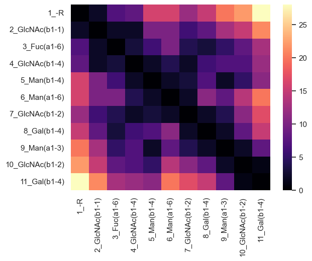
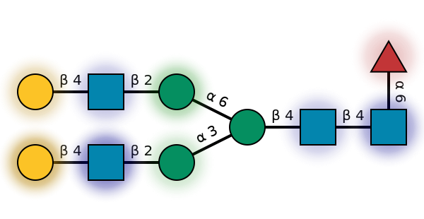
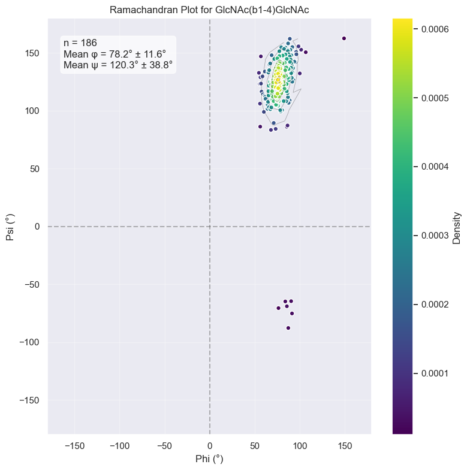

# GlyContact: 3D Analysis of Glycan Structures

GlyContact is a Python package for retrieving, processing, and analyzing 3D glycan structures from GlycoShape/molecular dynamics, NMR, or X-ray crystallography. While glycans are traditionally represented as linear text sequences, their branched structures and high flexibility create a complex 3D landscape that affects their biological function.

GlyContact provides a comprehensive toolkit for analyzing 3D glycan structures, enabling researchers to:

1. Visualize complex glycan structures with 3D-SNFG symbols
2. Quantify structural properties such as SASA and flexibility
3. Analyze conformational preferences and structure variability
4. Compare different glycan structures
5. Generate structural features for machine learning applications

These capabilities help bridge the gap between glycan sequence and function by revealing the critical spatial arrangements that determine molecular recognition.

## Installation

```bash
pip install git+https://github.com/lthomes/glycontact.git
```

An optional `[ml]` install is available for machine learning features:

```bash
pip install -e git+https://github.com/lthomes/glycontact.git#egg=glycontact[ml]
```

## Glycan Contact Maps

Contact maps reveal the spatial relationships between monosaccharides in a glycan structure. These maps help identify which parts of the glycan are in close proximity, providing insights into potential functional regions.


```python
from glycontact.process import get_contact_tables
# Get monosaccharide contact tables
glycan = "Gal(b1-4)GlcNAc(b1-2)Man(a1-3)[Gal(b1-4)GlcNAc(b1-2)Man(a1-6)]Man(b1-4)GlcNAc(b1-4)[Fuc(a1-6)]GlcNAc"
contact_tables = get_contact_tables(glycan, level="monosaccharide")

from glycontact.visualize import draw_contact_map
# Visualize the first contact map
draw_contact_map(contact_tables[0], size=1.0)
```


    

    


## Surface Accessibility and Flexibility

The solvent-accessible surface area (SASA) and flexibility of monosaccharides are crucial determinants of glycan-protein interactions. GlyContact calculates these properties and allows visualization of their distribution across the glycan structure.


```python
from glycontact.visualize import plot_glycan_score
plot_glycan_score(glycan, attribute="SASA")
```


    

    


## Glycosidic Torsion Angles

Glycosidic torsion angles (phi/psi) determine the overall shape of glycans. GlyContact can analyze these angles across multiple structures to identify preferred conformations, similar to protein Ramachandran plots.


```python
from glycontact.visualize import ramachandran_plot
ramachandran_plot("GlcNAc(b1-4)GlcNAc")
```


    

    


## Contributing

Contributions to GlyContact are welcome! Please feel free to submit a Pull Request.

## Citation

If you use GlyContact in your research, please cite:

```
[Citation information will be added upon publication]
```

## License

This project is licensed under the MIT License—see the LICENSE file for details.


```python

```
